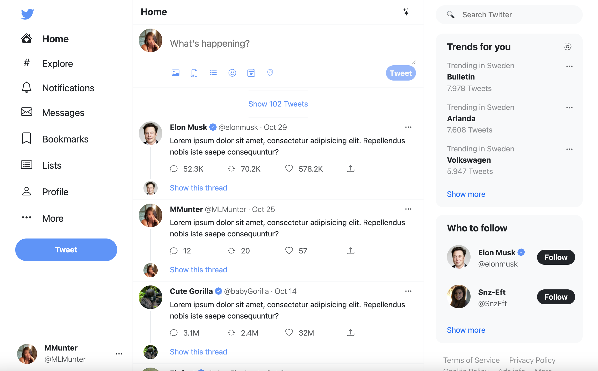
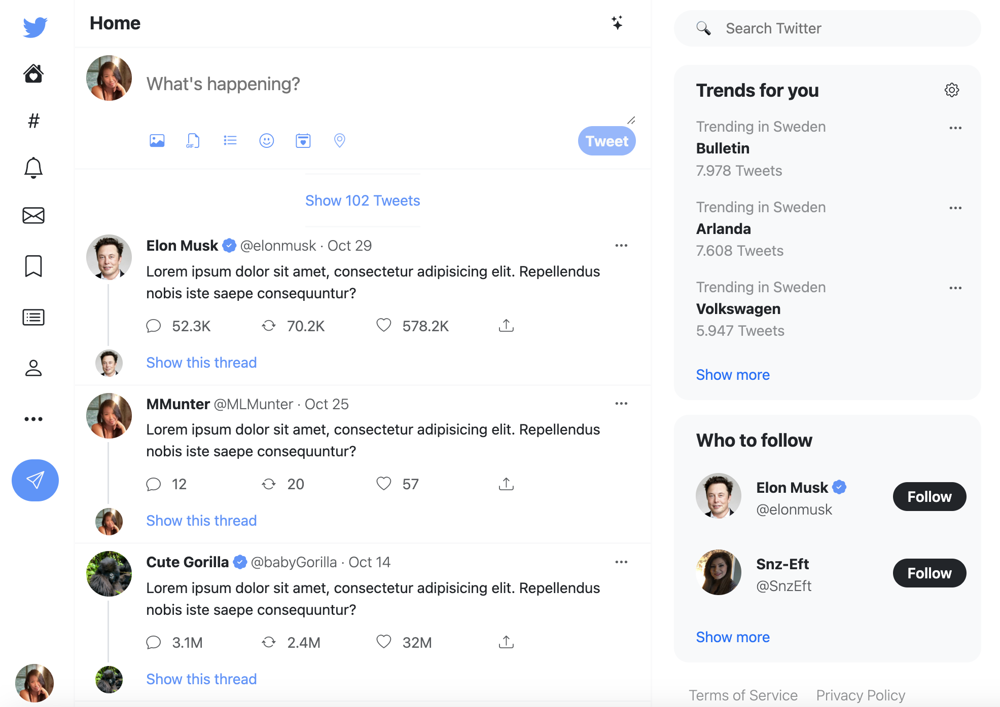
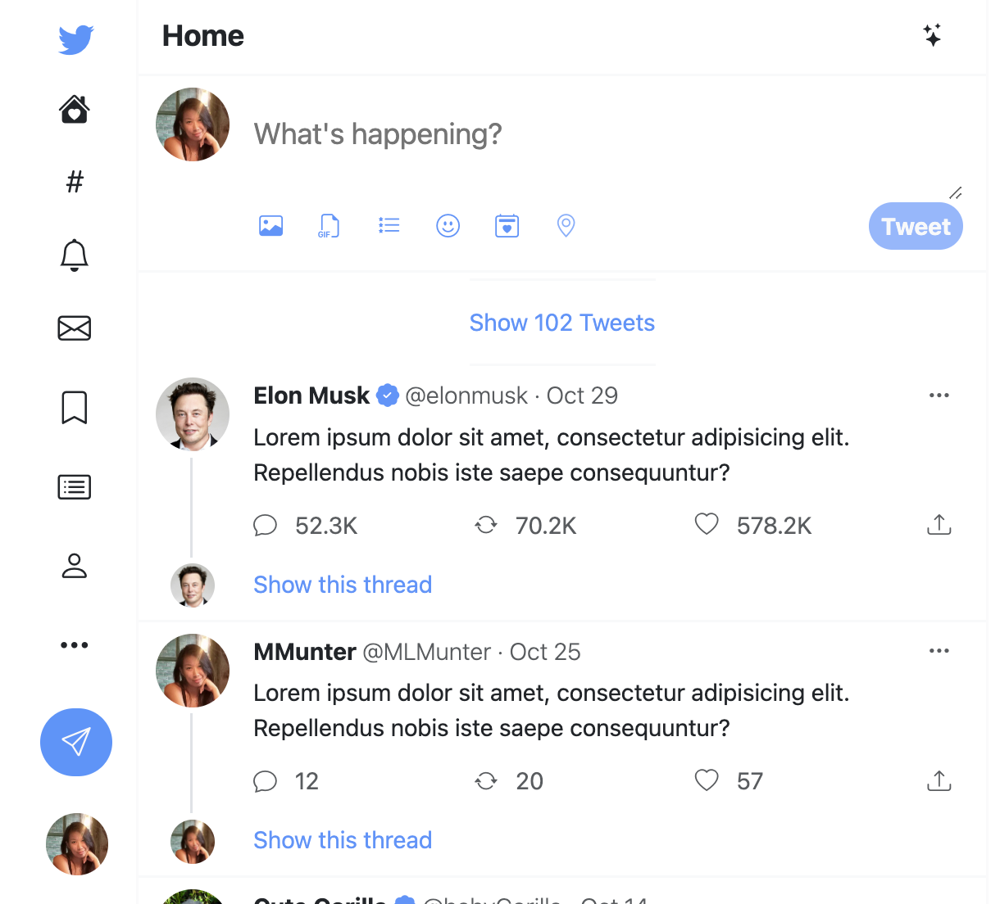
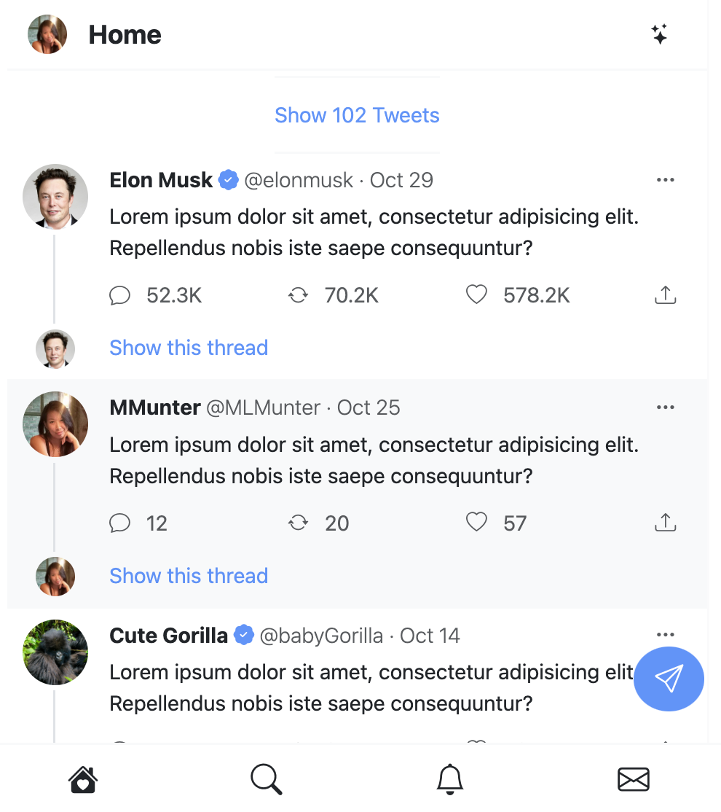

# **Twitter-clone**

This is a FrontEnd Twitter clone that was made as an assignment in the course FrontEnd 2. [Click here](https://mikamunterud.github.io/Twitter-clone/) to check it out.

## **Assignment description**

 The task is to use Bootstrap and CSS to build a Webpage that looks like Twitter homepage when signed in.

* You do not need to use external icon-libraries, emojis works as well.
* We are not after a picture perfect copy, but all elements should be in place.
* Creativity is encouraged.

### **Clarification**

The task is to create a Twitter clone based on a live design and webpage. It must have at least one breakpoint and change the webpage content in the same way as a live Twitter page does. Consider how it looks in tablet mode and mobile mode. You do not have to use an icon library. You do not have to apply accessibility standards, but it is a plus.

## **Final Project**

To learn how to use an external CSS framework this project was created with using mainly Bootstrap and minimal use of regular CSS.

Some colours and effects are not exactly like a Live Twitter but this became part of the experience to see which restrictions of only using Bootstrap exists.

This Twitter clone was made with the same responsive parts as a live Twitter homepage.

### **Full view**

### **Mid view**

### **Small view**

### **Extra Small view**

